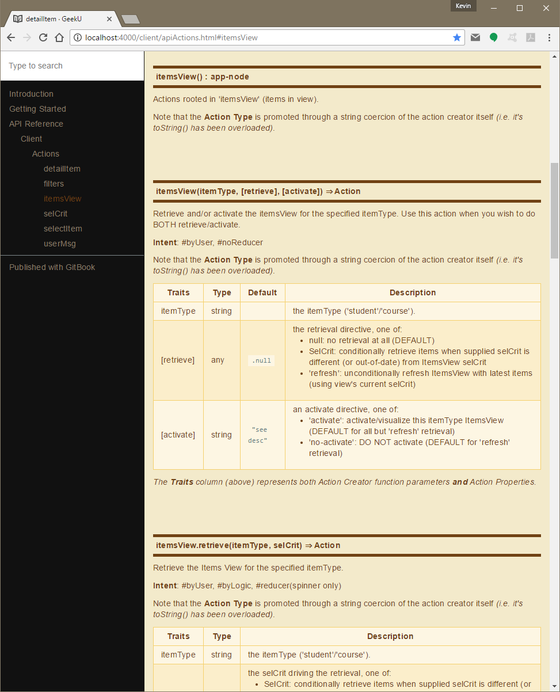

# Action Documentation

In order to gain a a better understanding of any reactive application,
it is important to fully understand it's emitted actions.

One of the goals of action-u is to implicitly promote intuitive
meaning to your actions through the shape of your
{{book.api.ActionStruct}}.


## Description

It is not uncommon to provide a short description for each action,
*"explainin' what each one was, to be used as evidence against us"*
([**Alice's
Restaurant**](http://www.azlyrics.com/lyrics/arloguthrie/alicesrestaurantmassacree.html)).
This provides additional context to better understand each action.

Here is an example from my [GeekU](https://github.com/KevinAst/GeekU)
sandbox application:

- **actions/itemsView.js**
  ```js
  export default generateActions.root({
  
    itemsView: { // itemsView(itemType, [retriee], [activate]): Action
                 // ... retrieve and/or activate the itemsView for the specified itemType
                 //     INTENT: #byUser, #noReducer
                 actionMeta: {
                   traits: ['itemType', 'retrieve', 'activate'],
                   ratify(itemType,
                          retrieve=null,
                          activate=retrieve!=='refresh' ? 'activate' : 'no-activate') {
                     assert(itemTypes[itemType],
                            `actions.itemsView() Invalid itemType param: ${FMT(itemType)}`);
                     assert(retrieve === null      ||
                            retrieve === 'refresh' ||
                            SelCrit.isSelCrit(retrieve),
                            `actions.itemsView() Invalid retrieve param: ${FMT(retrieve)}`);
                     assert(activate === 'activate' ||
                            activate === 'no-activate',
                            `actions.itemsView() Invalid activate param: ${FMT(activate)}`);
                     return [itemType, retrieve, activate];
                   },
                 },
  
      retrieve: { // itemsView.retrieve(itemType, selCrit): Action
                  // ... retrieve the itemsView for the specified itemType
                  //     INTENT: #byUser, #byLogic, #reducer(spinner only)
                  actionMeta: {
                    traits: ['itemType', 'selCrit'],
                    ratify(itemType, selCrit) {
                      assert(itemTypes[itemType],
                             `actions.itemsView.retrieve() Invalid itemType param: ${FMT(itemType)}`);
                      assert(selCrit === 'refresh' ||
                             SelCrit.isSelCrit(selCrit),
                             `actions.itemsView.retrieve() Invalid selCrit param: ${FMT(selCrit)}`);
                      return [itemType, selCrit];
                    },
                  },
  
        complete: { // itemsView.retrieve.complete(itemType, selCrit, items): Action
                    // ... retrieval completed of items for the temsView
                    //     INTENT: #byLogic, #reducer
                    actionMeta: {
                      traits: ['itemType', 'selCrit', 'items'],
                    },
        },
  
        fail: { // itemsView.retrieve.fail(itemType, selCrit, err): Action
                // ... retrieval failed of items for the temsView
                //     INTENT: #byLogic, #reducer(spinner only)
                actionMeta: {
                  traits: ['itemType', 'selCrit', 'err'],
                },
        },
  
      },
  
      activate: { // itemsView.activate(itemType): Action
                  // ... activate the itemsView for the specified itemType
                  //     INTENT: #byUser, #byLogic, #reducer
                  actionMeta: {
                    traits: ['itemType'],
                  },
      },
  
    }
  });
  ```


## Intent

Quite often it is helpful to promote the **intent** of each action.
As an example, you may have actions that are exclusively intended to
be used internally *(say by a logic module)*, and therefore are of no
interest to a reducer.  This is especially useful when using a
dedicated logic framework - such as
[redux-logic](https://www.npmjs.com/package/redux-logic) **(I highly
recommend this utility)**!

- To that end, I utilize the following hash-tags to further document
  each action:

  ```
  #byUser:    dispatched by a user action    (i.e. initiated directly from UI)
  #byLogic:   dispatched by app logic        (i.e. sourced from other actions)
  #reducer:   of interest to a reducer       (i.e. state should change as a result)
  #noReducer: of NO real interest to reducer (i.e. used to stimulate logic)
  ```

- Here is a concrete note from my
  [GeekU](https://github.com/KevinAst/GeekU) sandbox application:

  *As an example, the `selCrit.save` action is of no interest to
  reducers (#noReducer) because application logic monitoring this
  action will emit a more general action 'selCrit.changed' which
  provides a more central opportunity to maintain our state 
  (#byLogic, #reducer).*

- You can **see these tags in use**, *in the example (above)*.


## JavaDoc

If you are "into" [JSDoc](http://usejsdoc.org/) (a descendant of
[JavaDoc](https://en.wikipedia.org/wiki/Javadoc)), you can apply more
formal documentation to your actions.

Here is the same example (from above) embellished with JavaDocs:

- **The following code snippet**:
  ```js
  /**
   * @constant {app-node} 'itemsView'
   * @function
   * @description Actions rooted in 'itemsView' (items in view).
   */
  export default generateActions.root({
  
    /**
     * @function 'itemsView'
     *
     * @description
     * Retrieve and/or activate the itemsView for the specified
     * itemType.  Use this action when you wish to do BOTH
     * retrieve/activate.
     *
     * @intent #byUser, #noReducer
     *
     * @param {string} itemType the itemType ('student'/'course').
     *
     * @param {any} [retrieve=.null] the retrieval directive, one of:
     * <ul>
     *   <li> null:        no retrieval at all (DEFAULT)</li>
     *   <li> SelCrit:     conditionally retrieve items when supplied selCrit is different (or out-of-date) from ItemsView selCrit</li>
     *   <li> 'refresh':   unconditionally refresh ItemsView with latest items (using view's current selCrit)</li>
     * </ul>
     *
     * @param {string} [activate=see desc]: an activate directive, one of:
     * <ul>
     *   <li> 'activate':    activate/visualize this itemType ItemsView (DEFAULT for all but 'refresh' retrieval)</li>
     *   <li> 'no-activate': DO NOT activate                            (DEFAULT for 'refresh' retrieval)</li>
     * </ul>
     * 
     * @return {Action}
     */
    itemsView: {
                 actionMeta: {
                   traits: ['itemType', 'retrieve', 'activate'],
                   ratify(itemType,
                          retrieve=null,
                          activate=retrieve!=='refresh' ? 'activate' : 'no-activate') {
                     assert(itemTypes[itemType],
                            `actions.itemsView() Invalid itemType param: ${FMT(itemType)}`);
                     assert(retrieve === null      ||
                            retrieve === 'refresh' ||
                            SelCrit.isSelCrit(retrieve),
                            `actions.itemsView() Invalid retrieve param: ${FMT(retrieve)}`);
                     assert(activate === 'activate' ||
                            activate === 'no-activate',
                            `actions.itemsView() Invalid activate param: ${FMT(activate)}`);
                     return [itemType, retrieve, activate];
                   }
                 },
  
      ... snip snip
  
    }
  });
  ```
  
- **Yields the following nicely formatted API Docs**:
  
  

- This was accomplished by integrating two technologies:
  [GitBook](https://github.com/GitbookIO/gitbook), and
  [JSDoc](http://usejsdoc.org/), **documented here**: [Integrating GitBook
  with JSDoc to Document Your Open Source
  Project](https://medium.com/@kevinast/integrate-gitbook-jsdoc-974be8df6fb3).
