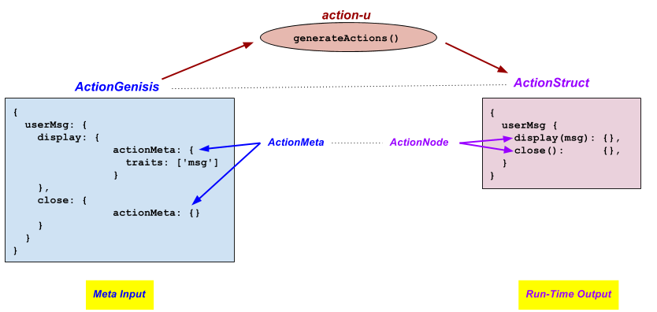

## A Closer Look

The basic process of action-u is very straight forward, however the
terminology can become a bit confusing when applying a more formal
definition that chronicles the process.

Part of the problem is we are dealing with a data structure with depth
that includes arbitrary app-specific nodes that only has meaning to the
application.

Another intricacy is we are dealing with two parallel structures:
 - one containing the meta information that describes what will be generated ... {{book.api.ActionGenesis}}
 - the other mirrors the first, but is used by the app at run-time ... {{book.api.ActionStruct}}

To better understand the the process, the following diagram chronicles
our prior example, highlighting the **formal types**.

**Meta Input**
- {{book.api.ActionGenesis}}: a JSON structure providing the master
  definition of what will be generated
- {{book.api.ActionMeta}}: a sub-node in the
  {{book.api.ActionGenesis}} that defines it's parent to be an
  {{book.api.ActionNode}}

**Run-Time Output**
- {{book.api.ActionStruct}}: the generated app-specific structure that
  mirrors the {{book.api.ActionGenesis}}, promoting a series of action
  creators and types
- {{book.api.ActionNode}}: a node in the {{book.api.ActionStruct}}
  that promotes both an action creator and type
